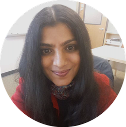

{::options parse_block_html="true" /}

The 2020 NSF Cyberinfrastructure for Sustained Scientific Innovation (CSSI) 
Principal Investigator (PI) workshop will be held February 13-14, 2020 in downtown Seattle, WA. The meeting venue will be at Residence Inn by Marriott Seattle Downtown/Convention Center, 1815 Terry Avenue, Seattle, Washington 98101 (<a href="https://goo.gl/maps/83CVQXAFa2Y142sz6" target="_blank">map direction</a>). 

This meeting will co-locate and partner with the SIAM Conference on Parallel Processing for Scientific Computing (PP20).

<!-- important dates -->

    

        

            <header>
                <h2>Important Dates</h2>
            </header>
            

                

                    Workshop dates: <strong>February 13-14, 2020</strong> 
                    Workshop Registration: <strong>January 21, 2020</strong> 
                    Poster Submission: <strong>January 15, 2020</strong> 
                    Lightning Talk Submission: <strong>January 15, 2020</strong>  
                    Presentation/poster upload: <strong>February 7, 2020</strong>   
                

            

        

    

<!-- Report Section
<section class="wrapper style3 special" markdown="0">
    

        

            <header>
                <h3>Workshop Report</h3>
            </header>
            <iframe src="https://widgets.figshare.com/articles/7152461/embed?show_title=1" width="100%" height="500" frameborder="0"></iframe>
        

    

</section>
-->

    

        

            <header>
                <h2><strong>Agenda</strong></h2>
            </header>
            

                <strong>Thursday, February 13, 2020</strong> (Room: <strong>TBD</strong>)
                <table class="default stripped agenda">
                    <tr>
                        <th width="10%">Time</th>
                        <th>Event</th>
                        <th width="25%">Speaker</th>
                        <th width="10%"></th>
                    </tr>
                    <tr>
                        <td>7:15am</td>
                        <td>Breakfast TBD</td>
                        <td></td>
                        <td></td>
                    </tr>
                    <tr class="up">
                        <td>7:30am</td>
                        <td>Breakfast and Registration</td>
                        <td></td>
                        <td></td>
                    </tr>
                    <tr>
                        <td>8:30am</td>
                        <td><a href="https://figshare.com/articles/2018_si2_welcome_2018_pdf/6204143" target="_blank">Welcome Address</a></td>
                        <td>Haiying SHen</td>
                        <td></td>
                    </tr>
                    <tr>
                        <td>8:45am</td>
                        <td>NSF CISE and <a href="presentations/2018-friedlander-SI2.pdf" target="_blank">OAC Directions</a></td>
                        <td>TBD</td>
                        <td></td>
                    </tr>                    
                    <tr class="up">
                        <td>9:30am</td>
                        <td>Coffee Break</td>
                        <td></td>
                        <td></td>
                    </tr>
                    <tr>
                        <td>10:00am</td>
                        <td><a href="https://figshare.com/articles/2018_si2_pi_walkerpeach_pdf/6204164" target="_blank">Talk title TBD</a></td>
                        <td>TBD</td>
                        <td></td>
                    </tr>
                    <tr>
                        <td>10:05am</td>
                        <td>Lightning Talks #1</td>
                        <td><a href="/2020-meeting/poster_sessions.html#session1">assignments</a></td>
                        <td rowspan="2" class="tnormal" style="line-height: 1.5em">Moderator: TBD</td>
                    </tr>                    
                    <tr>
                        <td>10:50am</td>
                        <td>Posters Session #1</td>
                        <td><a href="/2020-meeting/poster_sessions.html#session1">assignments</a></td>
                    </tr>                    
                    <tr class="up">
                        <td>noon</td>
                        <td>Lunch </td>
                        <td></td>
                        <td></td>
                    </tr>
                    <tr>
                        <td>1:00pm</td>
                        <td><a href="presentations/nanoHUB_briefing_stakehold_success_crit_impact_print.pdf" target="_blank">Title TBD</a></td>
                        <td>Speaker TBD</td>
                        <td rowspan="4" class="tnormal" style="line-height: 1.5em">Moderator: TBD</td>
                    </tr>                    
                    <tr>
                        <td>1:30pm</td>
                        <td>SI2 Institutes: <a href="presentations/SGCI-PI-meeting-4-30-18.pdf" target="_blank">Title TBD</a></td>
                        <td>TBD </td>
                    </tr>                    
                    <tr>
                        <td>2:00pm</td>
                        <td>SI2 Institutes: <a href="presentations/si2-pi-meeting-crawford.pdf" target="_blank">Title TBD</a></td>
                        <td>TBD</td>
                    </tr>  
                    <tr>
                        <td>2:30pm</td>
                        <td>Industry Highlight: <a href="presentations/NSF_SI2_PI_Meeting_043018_zetner.pdf" target="_blank">Title TBD</a></td>
                        <td>TBD</td>
                    </tr>  
                    <tr class="up">
                        <td>3:00pm</td>
                        <td>Coffee Break</td>
                        <td></td>
                        <td></td>
                    </tr>
                    <tr>
                        <td>3:15pm</td>
                        <td>Lightning Talks #2</td>
                        <td><a href="/2020-meeting/poster_sessions.html#session2">assignments</a></td>
                        <td rowspan="2" class="tnormal" style="line-height: 1.5em">Moderator: Kyle Niemeyer</td>
                    </tr>  
                    <tr>
                        <td>4:00pm</td>
                        <td>Posters Session #2</td>
                        <td><a href="/2020-meeting/poster_sessions.html#session2">assignments</a></td>
                    </tr>  
                    <tr class="up">
                        <td>5:00pm</td>
                        <td>Reception: finger food, with vegetarian options, and a cash bar</td>
                        <td></td>
                        <td></td>
                    </tr>
                </table>
                
<strong>** For selected PIs only.</strong>

            

            

                <strong>Friday, February 14, 2020</strong> (Room: <strong>TBD </strong>)
                <table class="default stripped agenda">
                    <tr>
                        <th width="10%">Time</th>
                        <th>Event</th>
                        <th width="25%">Speaker</th>
                        <th width="10%"></th>
                    </tr>
                    <tr class="up">
                        <td>7:30am</td>
                        <td>Breakfast and Registration</td>
                        <td></td>
                        <td></td>
                    </tr>
                    <tr>
                        <td>8:30am</td>
                        <td>Conceptualization: <a href="https://figshare.com/s/59f447dc6694dc5c9ece" target="_blank">Title TBD </a></td>
                        <td>TBD</td>
                        <td rowspan="3" class="tnormal" style="line-height: 1.5em">Moderator: TBD</td>
                    </tr>
                    <tr>
                        <td>9:00am</td>
                        <td>Conceptualization: <a href="http://elmer.web.cern.ch/elmer/si2pi2018.pdf" target="_blank">Title TBD</a></td>
                        <td>TBD </td>
                    </tr>                    
                    <tr>
                        <td>9:30am</td>
                        <td>Conceptualization: <a href="http://inundata.org/talks/si2" target="_blank">Title TBD</a></td>
                        <td>TBD</td>
                    </tr>                    
                    <tr class="up">
                        <td>10:00am</td>
                        <td>Coffee Break</td>
                        <td></td>
                        <td></td>
                    </tr>
                    <tr>
                        <td>10:15am</td>
                        <td>Lightning Talks #3</td>
                        <td><a href="/2020-meeting/poster_sessions.html#session3">assignments</a></td>
                        <td rowspan="2" class="tnormal" style="line-height: 1.5em">Moderator: Paul Bauman</td>
                    </tr>                    
                    <tr>
                        <td>11:00am</td>
                        <td>Posters Session #3</td>
                        <td><a href="/2020-meeting/poster_sessions.html#session3">assignments</a></td>
                    </tr>                    
                    <tr class="up">
                        <td>noon</td>
                        <td>Lunch</td>
                        <td></td>
                        <td></td>
                    </tr>
                    <tr>
                        <td>1:00pm</td>
                        <td class="lnormal">SSI Highlight: <a href="presentations/20180423-NSF-SSI2-15mintalk-Westerink-v21abr.pptx" target="_blank">Title TBD </a></td>
                        <td>TBD </td>
                        <td rowspan="6" class="tnormal" style="line-height: 1.5em">Moderator: TBD </td>
                    </tr>                    
                    <tr>
                        <td>1:15pm</td>
                        <td class="lnormal">SSE Highlight: <a href="presentations/si2-pi-meeting-shephard.pdf" target="_blank">Title TBD</a></td>
                        <td>TBD </td>
                    </tr>  
                    <tr>
                        <td>1:30pm</td>
                        <td class="lnormal">REU Highlight: <a href="https://doi.org/10.6084/m9.figshare.6203231.v2" target="_blank">NCSA's INCLUSION (Incubating a New Community of Leaders Using Software, Inclusion, Innovation, Interdisciplinary and OpeN-Science) REU Site</a></td>
                        <td>Dan Katz</td>
                    </tr>  
                    <tr>
                        <td>1:45pm</td>
                        <td class="lnormal">SSI Highlight: <a href="presentations/si2-pi-meeting-deelman.pdf" target="_blank">Distributed Workflow Management Research and Software in Support of Science</a></td>
                        <td>Ewa Deelman</td>
                    </tr>  
                    <tr>
                        <td>2:00pm</td>
                        <td class="lnormal">SSE Highlight: <a href="https://figshare.com/articles/Making_Software_Engineering_Work_for_Computational_Science_Engineering_An_Integrated_Approach/6174260" target="_blank">Making Software Engineering Work for Computational Science and Engineering: An Integrated Approach</a></td>
                        <td>Jeff Carver</td>
                    </tr>  
                    <tr>
                        <td>2:15pm</td>
                        <td class="lnormal">Software Security: <a href="https://figshare.com/articles/Steps_for_Transitioning_Software_From_Development_to_Operations_To_Science_The_Cybersecurity_Perspective/6225743" target="_blank">Selecting engineering and security practices to enable robust CI and trustworthy science</a></td>
                        <td>Von Welch</td>
                    </tr>  
                    <tr class="up">
                        <td>2:30pm</td>
                        <td>Coffee Break</td>
                        <td></td>
                        <td></td>
                    </tr>
                    <tr>
                        <td>2:45pm</td>
                        <td>Lightning Talks #4</td>
                        <td><a href="/2018-meeting/poster_sessions.html#session4">assignments</a></td>
                        <td rowspan="2" class="tnormal" style="line-height: 1.5em">Moderator: Frank Timmes</td>
                    </tr>  
                    <tr>
                        <td>3:30pm</td>
                        <td>Posters Session #4</td>
                        <td><a href="/2018-meeting/poster_sessions.html#session4">assignments</a></td>
                    </tr>  
                    <tr>
                        <td>4:30pm</td>
                        <td style="line-height: 1.5em">Panel Discussion and Combining Software and Data Programs  Ewa Deelman, Boyce Griffith, DK Panda, Abani Patra, and Haiying Shen</td>
                        <td></td>
                        <td class="tnormal" style="line-height: 1.5em">Moderator: Vipin Chaudhary</td>
                    </tr>  
                    <tr>
                        <td>5:00pm</td>
                        <td>Closing</td>
                        <td></td>
                        <td></td>
                    </tr>  
                </table>
            

        

    

<section class="wrapper style3" markdown="0">
    <header>
        <h3><strong>Poster presentation</strong></h3>
    </header>
    

        PIs are expected to present a poster on their project. We will  use <a href="https://figshare.com" target="_blank">Figshare</a> to host and share the posters digitally. Please follow these steps to upload your poster by <strong><u>February 7, 2020</u></strong>:
    

    

        1. Create or log into your <a href="https://figshare.com" target="_blank">Figshare</a> account. 
        2. Follow steps from "My Data" -> "Create a new item" to bring up the content upload form. 
        3. Fill in the appropriate metadata (authors, title). 
        4. Set the "Item type" to poster, and at the keyword stage put "<u>NSF-CSSI-2020</u>" as one of the chosen keywords. (Hit return/enter to separate keywords.) 
        5. You may also want to add your NSF award # to the "Funding" section. 
        6. For license, we recommend selecting "<a href="https://creativecommons.org/licenses/by/4.0" target="_blank">CC BY</a>" (which should be the default). 
        7. Please also add a brief abstract describing your project. 
        8. Hit publish!
    

    

        Please note that you are expected to print out and bring a physical copy on your own; we will not be printing any posters. Collaborative projects (including across multiple institutions) should only bring one poster.
    

</section>

<section class="wrapper style3" markdown="0">
    <header>
        <h3><strong>Lightning Talks</strong></h3>
    </header>
    

        Each project will also give a brief, one-minute lightning talk to introduce
        their poster. This is an opportunity to drive meeting participants to your poster.
        To avoid any technical issues and minimize delays, lightning talk slide(s)
        will need to be submitted by <strong><u>February 7, 2020</u></strong>.
        As for the posters, we will use <a href="https://figshare.com" target="_blank">Figshare</a>
        to gather your 1 slide pdf files.
        Follow the instructions given above for the posters but use the keyword
        "<u>NSF-CSSI-2020-Talk</u>" as one of the chosen keywords. Your pdf slide will
        be shown during your 1 minute Lightning Talk.
    

</section>

    

        

            <header>
                <h2>Organizing Committee</h2>
            </header>
            

                

                    
                    <h1>Haiying Shen (Chair)</h1>
                    
University of Virginia 

                

                

                    
                    <h1>Carol Song</h1>
                    
Purdue University 

                

                

                    
                    <h1>Upulee Kanewala</h1>
                    
Montana State University  

                

            

            

                

                    
                    <h1>Ritu Arora</h1>
                    
University of Texas, Austin 

                
   
                

                    
                    <h1>Sandra Gesing</h1>
                    
University of Notre Dame

                
             
                

                    
                    <h1>Natalia Villanueva Rosales</h1>
                    
University of Texas at El Paso

                
             
            

        

    

<!--

<section class="wrapper style1 container special" markdown="0">
    <header class="major">
       <h2>Past Meetings</h2>
    </header>
    

        

            <h3>2017 SI2 PI Meeting</h3>
            
Arlington, VA – 21-22 Feb 2017

            
<a href="https://si2-pi-community.github.io/2017-meeting/" target="_blank"><i class="fa fa-external-link"></i>&nbsp;&nbsp;Website</a>
                &nbsp;&nbsp;
                <a href="https://doi.org/10.6084/m9.figshare.4987013.v2" target="_blank"><i class="fa fa-file-o"></i>&nbsp;&nbsp;Report</a>
            

        

        

            <h3>2016 SI2 PI Meeting</h3>
            
Arlington, VA – 16-17 Feb 2016

            

                <a href="http://cococubed.asu.edu/si2_pi_workshop_2016/" target="_blank"><i class="fa fa-external-link"></i>&nbsp;&nbsp;Website</a>
                &nbsp;&nbsp;
                <a href="http://dl.acm.org/citation.cfm?id=2965630" target="_blank"><i class="fa fa-file-o"></i>&nbsp;&nbsp;Report</a>
            

        

        

            <h3>2015 SI2 PI Meeting</h3>
            
Arlington, VA – 17-18 Feb 2015

            

                <a href="http://cococubed.asu.edu/si2pimeeting2015/" target="_blank"><i class="fa fa-external-link"></i>&nbsp;&nbsp;Website</a>
                &nbsp;&nbsp;
                <a href="http://cococubed.asu.edu/si2_pi_workshop_2016/ewExternalFiles/nsf-si2piw_2015.pdf" target="_blank"><i class="fa fa-file-o"></i>&nbsp;&nbsp;Report</a>
            

        

    

    

        

            <h3>2014 SI2 PI Meeting</h3>
            
Arlington, VA – 24-25 Feb 2014

            

                <a href="https://sites.google.com/site/si2pimeeting2014/" target="_blank"><i class="fa fa-external-link"></i>&nbsp;&nbsp;Website</a>
                &nbsp;&nbsp;
                <a href="http://hdl.handle.net/2022/19760" target="_blank"><i class="fa fa-file-o"></i>&nbsp;&nbsp;Report</a>
            

        

        

            <h3>2013 SI2 PI Meeting</h3>
            
Arlington, VA – 17-18 Jan 2013

            

                <a href="https://sites.google.com/site/si2pimeeting/home" target="_blank"><i class="fa fa-external-link"></i>&nbsp;&nbsp;Website</a>
                &nbsp;&nbsp;
                <a href="http://dl.acm.org/citation.cfm?id=2747420" target="_blank"><i class="fa fa-file-o"></i>&nbsp;&nbsp;Report</a>
            

        

    

</section>
-->

<section class="wrapper style3" style="margin-bottom: 0" markdown="0">
    <header>
        <h3><strong>Code of Conduct</strong></h3>
    </header>
    

        The 2020 NSF CSSI PI Meeting is an interactive environment for listening and considering new ideas from a diverse group, with respect for all participants without regard to gender, gender identity or expression, race, color, national or ethnic origin, religion or religious belief, age, marital status, sexual orientation, disabilities, veteran status, or any other aspect of how we identify ourselves. It is the policy of the NSF SI2 PI Meeting that all participants will enjoy an environment free from all forms of discrimination, harassment, and retaliation.
    

    

        <strong>Definition of Sexual Harassment:</strong> 
        Sexual harassment refers to unwelcome sexual advances, requests for sexual favors, and other verbal or physical conduct of a sexual nature. Behavior and language that are welcome/acceptable to one person may be unwelcome/offensive to another. Consequently, individuals must use discretion to ensure that their words and actions communicate respect for others. This is especially important for those in positions of authority since individuals with lower rank or status may be reluctant to express their objections or discomfort regarding unwelcome behavior.  
        Sexual harassment does not refer to occasional compliments of a socially acceptable nature. It refers to behavior that is not welcome, is personally offensive, debilitates morale, and therefore, interferes with work effectiveness. The following are examples of behavior that, when unwelcome, may constitute sexual harassment: sexual flirtations, advances, or propositions; verbal comments or physical actions of a sexual nature; sexually degrading words used to describe an individual; a display of sexually suggestive objects or pictures; sexually explicit jokes; unnecessary touching.
    

    

        <strong>Definition of Other Harassment:</strong> 
        Harassment on the basis of any other protected characteristic is also strictly prohibited. This conduct includes, but is not limited to the following: epithets, slurs, or negative stereotyping; threatening, intimidating, or hostile acts; denigrating jokes and display or circulation of written or graphic material that denigrates or shows hostility or aversion toward an individual or group.
    

    

        <strong>Definition of Discrimination:</strong> 
        Discrimination refers to bias or prejudice resulting in denial of opportunity, or unfair treatment regarding selection, promotion, or transfer. Discrimination is practiced commonly on the grounds of age, disability, ethnicity, origin, political belief, race, religion, sex, etc. factors which are irrelevant to a person's competence or suitability.
    

    

        <strong>Definition of Retaliation:</strong> 
        Retaliation refers to taking some action to negatively impact another based on them reporting an act of discrimination or harassment.
    

    

        <strong>Reporting an Incident:</strong> 
        Violations of this code of conduct policy should be reported immediately to one of the five Organizing Committee Members. All complaints will be treated seriously and be investigated promptly. Confidentiality will be honored to the extent permitted as long as the rights of others are not compromised.  Sanctions may range from verbal warning, to ejection from the 2018 NSF SI2 PI Meeting, to the notification of appropriate authorities. Retaliation for complaints of inappropriate conduct will not be tolerated.
    

</section>
